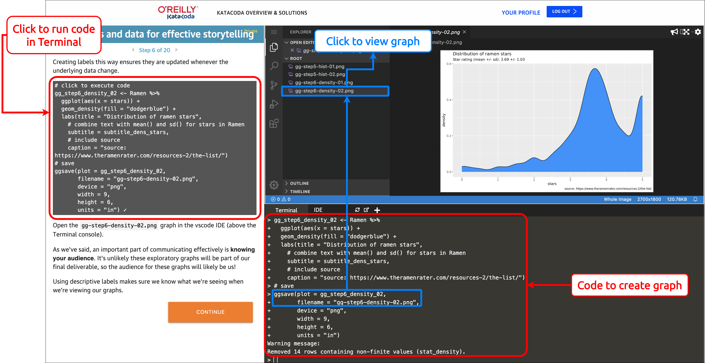
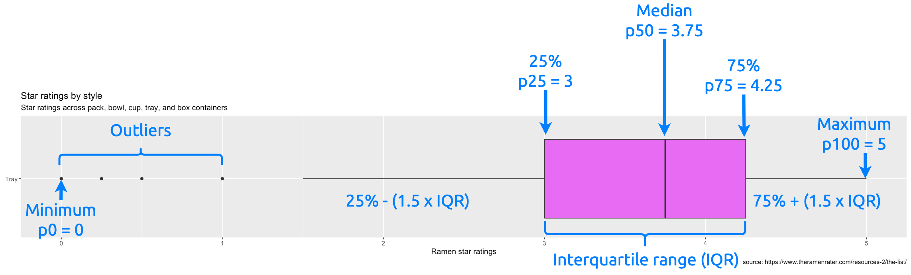

```{r setup, include=FALSE}
library(tint)
library(tidyverse)
library(knitr)
library(rmdformats)
library(skimr)
library(ggridges)
library(janitor)
knitr::opts_chunk$set(
  echo = TRUE,
  eval = TRUE,
  cache = FALSE,
  prompt = FALSE,
  tidy = FALSE,
  comment = "#>",
  message = TRUE,
  fig.width = 9,
  fig.height = 6,
  warning = TRUE,
  fig.path = "img/"
)
fs::dir_create("img/")
# invalidate cache when the package version changes
options(htmltools.dir.version = FALSE)
# download People data 
# download.file(url = "https://raw.githubusercontent.com/chadwickbureau/baseballdatabank/master/core/People.csv", 
              # destfile = "../data/People.csv")
```

## Setup 

Link to scenario: https://www.katacoda.com/orm-mfrigaard/scenarios/03-effective-storytelling

The `index.json` configuration file is set using the following environment: 

```json
"environment": {
  "uilayout": "editor-terminal-split"
},
"backend": {
  "imageid": "rlang:3.4"
}
```

## Outline 

Below are the 20 steps (plus `intro` and `finish`) files in the scenario. 

## Objectives

The objectives for this scenario are: 

1. recognize the needs of your audience (data literacy, level of expertise, etc.)

2. check and communicate data quality with stakeholders  

3. identify the correct data visualization (single variable, bivariate, and multivariate graphs) based on the data  

4. incorporate feedback from stakeholders/audience into graphs  

5. design visualizations with the appropriate detail and annotations that inform (and do not mislead) the audience  

## The learners 

The learners I'm expecting to be participating in this course are: 

- **Jessica** will take this class on her own time for professional development. 

- **Peter** will this course in a two-day weekend because he needs to complete a project.

- **Bruce** is using these scenarios to supplement a semester-long undergraduate course on R.

- **Jane** has been told to take this course for his job because his team is using R.


## intro

- [x] included in intro.md?

### Welcome!

Welcome to '*Combine narrative with numbers for effective storytelling in R*'! In this scenario, we will cover how to build data visualizations that effectively communicate and engage your audience. 

Now that we have some experience with data wrangling with [`tidyr` and `dplyr`](https://katacoda.com/orm-mfrigaard/scenarios/01-format-shape-data), and [data visualization with `ggplot2`](https://www.katacoda.com/orm-mfrigaard/scenarios/02-intro-ggplot2), we can put these tools together to get your point across to stakeholders and audiences. 

### What makes a bad graphic?

Bad graphs aren't just ugly; they're misleading. A chart can have pretty colors and novel font styling, but that can't make up for inaccurately presenting data. Mislabeling axes, using inappropriate scales or labels, and including unnecessary elements ('chart junk') are common characteristics of bad graphics. 

*We'll be using the terms 'graph', 'figure,' and 'chart' interchangeably throughout this scenario.*

[Claus Wilke](https://twitter.com/clauswilke) describes the difference between *ugly*, *bad*, and *wrong* graphs in his excellent text, [Fundamental of Data Visualization](https://clauswilke.com/dataviz/). 

- An *ugly* graph isn't aesthetic appealing, but the data presented is clear and informative  
- A *bad* graph fails to communicate the information it contains because of poor design  
- A graph is *wrong* if it's mathematically incorrect (the underlying calculations, representations, or transformations are inaccurate).  

We want to avoid making ugly, bad, *and* wrong graphs.

#### What makes a great graphic?

Have you ever heard a joke and thought, "it's funny *because* it's true"?

We all know a great data visualization when we see it, but can you explain *why* it's so great? Beyond just being aesthetically appealing (the choice of color palettes, fonts, etc.), data visualizations are tools for communicating complicated information. 

Well, great graphics are similar to great jokes in this way--they should reveal a complicated 'truth' that was otherwise difficult to comprehend or articulate with words alone. 

This scenario will show you how to make sure your graphs and figures communicate complexity effectively without misleading your audience.


## step 1

- [x] included in step1.md?

### Things to consider about your audience

You'll need to determine who the audience or stakeholders will be before creating graphs or figures. You'll likely create multiple charts throughout a data analysis that you won't include as a final deliverable.  But in most cases, our stakeholders or audience is whoever is getting the final results or product. 

The final graphs you produce will depend on 1) the question we're trying to answer, and 2) the level of [statistical literacy](https://en.wikipedia.org/wiki/Statistical_literacy#) of our audience. 

If your audience isn't familiar with particular data visualizations, provide them with enough information to interpret the graph (and check their understanding). However, if you find yourself spending more time explaining a data visualization's design than what the visualization reveals, we should consider a different graph. 

### Asking questions

Data visualization should be an iterative process, and getting regular feedback from your audience will help you understand their point of view. It will also help manage their expectations regarding the final deliverable.  

As Hilary Mason and D.J. Patil point out in their 2015 text, [Data Driven: Creating a Data Culture](https://www.oreilly.com/library/view/data-driven/9781491925454/), asking the right questions "*involves domain knowledge and expertise, coupled with a keen ability to see the problem, see the available data, and match up the two.*"

The questions below can help guide your project and make sure you understand what your audience/stakeholders are expecting:

1. *What question(s) is this project trying to answer?* (or *What problem(s) is this project trying to solve?*)  
2. *Do we have access to the data to answer the question/problem posed?* (or do we need to gather more data?)  
3. *What is the current format/structure/location of the data?* (this will have an enormous impact on the project timeline!)
4. *What context will we present the deliverable(s) in?* (slide deck, website, report, etc.)  
5. *How familiar will the audience be with the data in our project?* (how much background information should we be providing?)

Having the answers to these questions documented will 1) keep your project focused and timely, 2) ensure both you and your client/customer have a clear vision for successful completion. 

## step 2 

- [x] included in step2.md?

### Data lineage: the background on our data

It's best to start a project off with a '*view of the forest from outside the trees*'. The technical term for this is [data lineage](https://en.wikipedia.org/wiki/Data_lineage#), which 

> "includes the data origin, what happens to it, and where it moves over time."

Having a "birds" eye view' of the data ensures there weren't any problems with exporting or importing. Data lineage also means understanding where the data are coming from--was it collected from an internal relational database, an external vendor, or did it come from the web or social media?

Knowing some of the technical details behind a dataset lets us frame the questions or problems we're trying to tackle. 

### Initiate R 

Let's get started! Launch an R console by clicking here -> `R` (Click on the *Run command* icon)

### Load packages

The package we'll use to view the entire datasets with R is [`skimr`](https://docs.ropensci.org/skimr/). We will install and load these packages below:


```{r step2-packages, message=FALSE, warning=FALSE, results='hide', eval=FALSE}
install.packages(c("tidyverse", "skimr"))
library(tidyverse)
library(skimr)
```


### Navigating Katacoda

Let's take a quick tour of our Katacoda environment. In the next 18 steps, we'll be running code, viewing output, and creating graphs. To accomplish this, we'll need to understand what tools are at our disposal: 

**Sidebar**

You're reading this in the **Sidebar**. All of the instructions are in the Sidebar, and at the bottom, you'll find a "*Continue*" button to take you to the next step. See the image below:

<!--

-->

```{r img-sc-03-sidebar, echo=FALSE, out.width='100%', out.height='100%'}
# fs::dir_ls("img")
knitr::include_graphics("https://raw.githubusercontent.com/mjfrigaard/katacoda-scenarios/master/03-effective-storytelling/docs/img/sc-03-sidebar.png")
```

**Code blocks**

You will also find **code blocks** in the Sidebar. All the code blocks will run when you click on them (you've already run a few above!). See the image below for more examples:

<!-- 
 
-->

```{r img-sc-03-code-blocks, echo=FALSE, out.width='100%', out.height='100%'}
# fs::dir_ls("img")
knitr::include_graphics("https://raw.githubusercontent.com/mjfrigaard/katacoda-scenarios/master/03-effective-storytelling/docs/img/sc-03-code-blocks.png")
```

**Terminal**

The **Terminal** is where the R code from each code block will run, along with any text **output**. We can also use R interactively by typing them directly into the Terminal after the **Prompt `>`**. 

Go ahead and try it by typing (or copying and pasting) the following commands:

```{r tidyverse_logo}
tidyverse::tidyverse_logo()
```

You should see the following output in the **Terminal**: 

<!-- 
 
-->

```{r img-sc-03-terminal-code, echo=FALSE, out.width='100%', out.height='100%'}
# fs::dir_ls("img")
knitr::include_graphics("https://raw.githubusercontent.com/mjfrigaard/katacoda-scenarios/master/03-effective-storytelling/docs/img/sc-03-terminal-code.png")
```

**VSCODE (EXPLORER)**

When we create graphs, we will include the `ggplot2::ggsave()` function in the code block. This function allows us to save the graph image as a `.png` file in the **VSCODE EXPLORER**.

**VSCODE (ROOT)**

Inside the VSCODE EXPLORER, you'll find a section labeled **ROOT.** ROOT is a folder that contains our new graph files. We can open the **Graph file** by clicking on them. See the image below for an example:

<!-- 
 
-->

```{r img-sc-03-explorer-root, echo=FALSE, out.width='100%', out.height='100%'}
knitr::include_graphics("https://raw.githubusercontent.com/mjfrigaard/katacoda-scenarios/master/03-effective-storytelling/docs/img/sc-03-explorer-root.png")
```

The image below gives you an overview of this entire process:

```{r img-sc-03-code-run-png-view.png, echo=FALSE, out.width='100%', out.height='100%'}
# knitr::include_graphics("https://raw.githubusercontent.com/mjfrigaard/katacoda-scenarios/master/03-effective-storytelling/docs/img/sc-03-code-run-png-view.png")

```


Now that we know how to navigate the Katacoda environment, we can start exploring data and building graphs!


## step 3

- [x] included in step3.md?

### Before you start: what do we expect to see?

Generally speaking, we should have an idea about how many columns and rows the new dataset will contain. We should know some general information about the variable formats, too. 

For example, we should see if we're getting date columns (`YYYY-MM-DD`), logical (`TRUE`, `FALSE`, `NA`), numerical measurements (integer (`1L`) or double (`1`)), or categorical data (character (`male` and `female`) or factor (`low`, `medium`, `high`)).

We're going to load a dataset to demonstrate how to investigate a dataset's quality or *how well it matches our expectations*? 

These data come from [Sean Lahman's Baseball Database](http://www.seanlahman.com/baseball-archive/statistics/)".

### Why baseball data? 

Now, I am not going to assume everyone participating in this scenario is familiar with baseball. However, this exercise is arguably more rewarding if you are *not* a baseball fan. If you're working with data, part of your job to be interested in whatever you've been asked to analyze (even if it is only for the monetary reward).

> "...if you want to work in data visualisation, you need to be relentlessly and systematically curious. You should try to get interested in anything and everything that comes your way." - Alberto Cairo, Knight Chair in Visual Journalism, University of Miami

Analyzing and visualizing data you're not familiar with is a chance to learn something new, and it puts you in a position to ask 'out of the box' questions. 

### Doing your homework

It's also essential to read any accompanying documentation for new datasets. If we read the documentation on the [Lahman website](http://www.seanlahman.com/files/database/readme2017.txt), we find out that `People` contains "*Player names, DOB, and biographical info.*" 
The variables in `People` are presented below: 

**People table**

`playerID` = A unique code assigned to each player. The `playerID` links the data in this file with records in the other files.
`birthYear` = Year player was born  
`birthMonth` = Month player was born  
`birthDay` = Day player was born  
`birthCountry` = Country where player was born  
`birthState` = State where player was born  
`birthCity` = City where player was born
`deathYear` = Year player died  
`deathMonth` = Month player died  
`deathDay` = Day player died  
`deathCountry` = Country where player died   
`deathState` = State where player died  
`deathCity` = City where player died  
`nameFirst` = Player's first name  
`nameLast` = Player's last name  
`nameGiven` = Player's given name (typically first and middle)  
`weight` = Player's weight in pounds  
`height` = Player's height in inches  
`bats` = Player's batting hand (left, right, or both)          
`throws` = Player's throwing hand (left or right)  
`debut` = Date that player made first major league appearance  
`finalGame` = Date that player made first major league appearance (blank if still active)  
`retroID` = ID used by retrosheet  
`bbrefID` = ID used by Baseball Reference website   


Now that we have some background information on this new dataset, we will look at how well `People` meets our expectations.  

Whenever we get a new data source, we should try to view the data in its native format (if possible). We can view the raw data on the [Github repository](https://resources.oreilly.com/katacoda/martin-frigaard/blob/master/03-effective-storytelling/data/People.csv). 

### Load data

Fortunately, we are also able to load the raw data directly into R using the `readr::read_csv()` function. We will load the `People` dataset into R using `readr::read_csv()`, and assign `"https://bit.ly/3scsHw7"` to the `file` argument. 

```{r get_bbdb-People, message=FALSE, warning=FALSE}
People <- readr::read_csv(file = "https://bit.ly/3scsHw7")
```

## step 4

- [x] included in step4.md?

### Are we seeing what we expected?

Before creating any visualizations, we want a display that gives us an overview of the entire `People` dataset. This way, we can see if we imported all the variables and observations correctly.

### Skimming data

We'll be using the [`skimr` package](https://docs.ropensci.org/skimr/). `skimr` was is designed for:

> "displaying summary statistics the user can skim quickly to understand their data"

Below we pass the `People` dataset to the `skimr::skim()` function to create `PeopleSkim`. We then use the `base::summary()` function to review the new object.

If this code looks unfamiliar to you, review the [Introduction to `ggplot2` scenario](https://www.katacoda.com/orm-mfrigaard/scenarios/02-intro-ggplot2).

```{r PeopleSkim}
PeopleSkim <- People %>%  
  skimr::skim()
summary(PeopleSkim)
```


The output above shows a high-level summary of all the variables in the `People` dataset. We can see there are `20090` rows and `24` columns (`14` columns are `character`s, `2` columns are `Date`s, and `8` are `numeric`).

### Viewing variables by type

The new `PeopleSkim` object gives us summary information to check against the documentation and help guide our data visualizations. We will start by viewing the variables according to their types in `People` using `skimr::yank()` (read the [function documentation on Github](https://github.com/ropensci/skimr/blob/master/R/reshape.R#L138)). The `skim_type` argument in `skimr::yank()` takes a variable type (`"character"`, `"numeric"`, or `"Date"`). 

Run the code below to use `skimr::yank()` to view a `skim` of the `character` variables in the `People` dataset.

```{r char-vars-skim}
PeopleSkim %>% 
  skimr::yank(skim_type = "character")
```

We can see none of these data are missing (`n_missing` and `complete_rate`). `Skimr::skim()` also shows us the `min`, `max`, `empty`, `n_unique`, and `whitespace` for the `14` character values. 

Next, we use `skimr::yank()` to view a `skim` of the `Date` variables in the `People` dataset.

```{r date-vars-skim}
PeopleSkim %>% 
  skimr::yank(skim_type = "Date")
```

The `skim` of the `Date` variables shows us which data are missing (`n_missing` and `complete_rate`), along with the earliest (`min`), latest (`max`), middle (`median`), and the number of unique (`n_unique`) of dates.

*Do these numbers make sense?*

We can use these values for sanity checks. For example, the `n_unique` for `playerID` matches the total number of rows in `People`, which we should expect from the documentation (`playerID` = "*A unique code assigned to each player*"). The earliest dates for both `debut` and `finalGame` are in May of 1871 (which corresponds to the [first MLB game ever played](https://www.retrosheet.org/1stGame.htm)).

Finally, we will use `skimr::yank()` to view the `"numeric"` variables in `People`.

```{r num-vars-skim}
PeopleSkim %>% 
  skimr::yank("numeric")
```


The numeric variables give us some additional information about these `8` columns. Along with `n_missing` and `complete_rate`, we get [set of summary statistics](https://en.wikipedia.org/wiki/Summary_statistics): 

**Location statistics**

- the `mean` (or average) gives us the expected value for each variable  
- the median (as `p50`) or the 'center' value for each variable. Half of the values are above, and half are below.

**Spread statistics**

- the lowest value for each variable, or minimum (as `p0`)  
- the highest value for each variable, or maximum (as `p100`)  
*Together, these two values can give us the range, which is the difference between the maximum and minimum values*

- the first quartile (as `p25`), which is the 'middle' of the data points *below* the median  
- the third quartile (as `p75`), which is the 'middle' of the data points *above* the median  
*Together, these two values can give us the interquartile range (IQR), which is the difference between the third and first quartiles*  

- the standard deviation (as `sd`), a measure of each variable's disbursement.
*The standard deviation describes how far a variable's values are spread out around their mean*

Below we use `skimr::focus()` and `skimr::yank()` to view the missing, mean, standard deviation, minimum, maximum, and a small histogram for the numeric variables in the `People` dataset:

```{r focus-num-missing}
PeopleSkim %>% 
  skimr::focus(n_missing, 
               numeric.mean, numeric.sd, 
               numeric.p0, numeric.p100,
               numeric.hist) %>% 
    skimr::yank("numeric") 
```


*Do these numbers make sense?*

We notice two implausible values from the `skimr` output: the `weight` variable maximum value (`2125`). We can use `dplyr`'s `filter` and `select` functions to find the `nameGiven` for the abnormally high `weight` value.

```{r weight-outlier}
People %>% 
  filter(weight == 2125) %>% 
  select(nameGiven, birthMonth, birthDay, birthYear, weight)
```

Google the player's name. *What is his listed weight on Wikipedia?*

As we can see, the majority of the missing values are in the variables with the `death` prefix (`deathDay`, `deathMonth`, and `deathYear`). The missing values in these variables make sense because, given the lowest `birthYear` value (`1820`), we should expect approximately half of the baseball players in the `People` dataset to be still alive.

### Other resources for missing data

Read more about visualizing missing data [here](http://naniar.njtierney.com/articles/naniar-visualisation.html) and on the [`visdat` package site](https://docs.ropensci.org/visdat/), or on the [`inspectdf` package](https://github.com/alastairrushworth/inspectdf) website. 


## step 5

- [x] included in step5.md?

### Single variable distributions (1)

The `skimr` output displayed a small histogram for each numeric variable in the `People` dataset in the previous step. Histograms show the distribution for a single variable.

### Load data

These data come from [the `TidyTuesday` project](https://github.com/rfordatascience/tidytuesday), a data repository who's intent is 

> "to provide a safe and supportive forum for individuals to practice their wrangling and data visualization skills independent of drawing conclusions."

We're going to use a dataset of Ramen ratings from [The Ramen Rater](https://www.theramenrater.com/resources-2/the-list/). Read more about these data [here](https://github.com/rfordatascience/tidytuesday/tree/master/data/2019/2019-06-04).

Below we import the raw data from an external .csv file into `Ramen` and get a `skimr::skim()` summary (stored in `RamenSkim`)

```{r import-Ramen, message=FALSE, warning=FALSE}
Ramen <- readr::read_csv("https://bit.ly/38sO0S7")
RamenSkim <- skimr::skim(Ramen)
```

### Review data 

View the character variables in `RamenSkim`

```{r RamenSkim-char}
RamenSkim %>% 
  skimr::yank("character")
```

*How complete are these data?*

View the numeric variables in `RamenSkim`

```{r RamenSkim-num}
RamenSkim %>% 
  skimr::yank("numeric")
```

Pay attention to the `hist` column for `stars`--it shows the distribution for the values. *What are most of the values concentrated?* 

We will investigate the distribution of `stars` by building a histogram with `ggplot2`.

### Build a histogram

We're going to use `ggplot2::geom_histogram()` to view the distribution the `stars` variable in `Ramen`. Note that we are also assigning labels to the graph that includes 1) a clear title, 2) descriptive information about the graph, 3) the source of the data.

```{r step5-hist-01, message=FALSE, warning=FALSE}
# click to execute code
gg_step5_hist_01 <- Ramen %>% 
  ggplot2::ggplot(aes(x = stars)) + 
  ggplot2::geom_histogram() + 
  ggplot2::labs(
       title = "Distribution of ramen stars", 
       subtitle = "bins = 30",
       caption = "source: https://www.theramenrater.com/resources-2/the-list/")
# save
# ggsave(plot = gg_step5_hist_01,
#        filename = "gg-step5-hist-01.png",
#        device = "png",
#        width = 9,
#        height = 6,
#        units = "in")
gg_step5_hist_01
```

We will need to open the `gg-step5-hist-01.png` graph in the vscode IDE (above the Terminal console). 

Histograms are built by stacking the variable values into a defined set of `bins`. The default number for `bins` is `30`. We can change the shape of the histogram by changing the `bins` argument. 

Run the code below to see how the distribution looks with 20 `bins`. Note we also include the `color = "white"` argument to ensure we can see each bar separately. 

```{r gg_step5_hist_02, message=FALSE, warning=FALSE}
# click to execute code
gg_step5_hist_02 <- Ramen %>% 
  ggplot2::ggplot(aes(x = stars)) + 
  ggplot2::geom_histogram(bins = 20, color = "white") + 
  ggplot2::labs(
       title = "Distribution of ramen stars", 
       subtitle = "bins = 20",
       caption = "source: https://www.theramenrater.com/resources-2/the-list/")
# save
# ggsave(plot = gg_step5_hist_02,
#        filename = "gg-step5-hist-02.png",
#        device = "png",
#        width = 9,
#        height = 6,
#        units = "in")
gg_step5_hist_02
```

Open the `gg-step5-hist-02.png` graph in the vscode IDE (above the Terminal console). 

The `stars` values fit into `20` bins better than the default `30` because we can see where values are concentrated (and the high frequency of 5-star ratings).

## step 6

- [x] included in step6.md?

### Single variable distributions (2)

The previous step demonstrated how to use a histogram to view the distribution of a single variable. We needed to adjust the `bins` in the histogram to make its shape easier to interpret. Density plots use [kernel smoothing](https://ggplot2-book.org/statistical-summaries.html) to create cleaner distributions. 


### Build a density plot

We're going to use `ggplot2::geom_density()` to view a density plot of the `stars` variable in `Ramen`. We will use `fill` to color the area underneath the density line with `"dodgerblue"`.

```{r gg_step6_density_01, message=FALSE, warning=FALSE}
# click to execute code
gg_step6_density_01 <- Ramen %>% 
  ggplot(aes(x = stars)) + 
  geom_density(fill = "dodgerblue") + 
  labs(title = "Distribution of ramen stars", 
  caption = "source: https://www.theramenrater.com/resources-2/the-list/")
# save
# ggsave(plot = gg_step6_density_01,
#        filename = "gg-step6-density-01.png",
#        device = "png",
#        width = 9,
#        height = 6,
#        units = "in")
gg_step6_density_01
```

Open the `gg-step6-density-01.png` graph in the vscode IDE (above the Terminal console). 

### Adding useful labels 

Although density plots create a much smoother distribution, the `y` axis is harder to interpret. To overcome this, we will add two summary statistics programmatically to the labels using the `base::paste0()` and `base::round()` functions. 

Run the code below to see how this works: 

```{r subtitle_dens_stars}
# click to execute code
subtitle_dens_stars <- paste0("Star rating (mean +/- sd): ", 
       # use round() to make sure there are only two decimals
       round(mean(Ramen$stars, na.rm = TRUE), 2),
       " +/- ",
       round(sd(Ramen$stars, na.rm = TRUE), 2))
subtitle_dens_stars
```

We can now supply `subtitle_dens_stars` to the `labs(subtitle = )` function. 

Creating labels this way ensures they are updated whenever the underlying data change. 

```{r gg_step6_density_02, message=FALSE, warning=FALSE}
# click to execute code
gg_step6_density_02 <- Ramen %>% 
  ggplot(aes(x = stars)) + 
  geom_density(fill = "dodgerblue") + 
  labs(title = "Distribution of ramen stars", 
       # combine text with mean() and sd() for stars in Ramen
       subtitle = subtitle_dens_stars,
       # include source
       caption = "source: https://www.theramenrater.com/resources-2/the-list/")
# save
# ggsave(plot = gg_step6_density_02,
#        filename = "gg-step6-density-02.png",
#        device = "png",
#        width = 9,
#        height = 6,
#        units = "in")
gg_step6_density_02
```

Open the `gg-step6-density-02.png` graph in the vscode IDE (above the Terminal console). 

As we've said, an essential part of effective communication is **knowing your audience**. It's unlikely these exploratory graphs will be part of our final deliverable, so the audience for these graphs will likely be us! 

Using descriptive labels makes sure we know what we're seeing when we're viewing our graphs.

## step 7

- [x] included in step7.md?

### Multiple variable distributions (1)

We've looked at the distribution of all the values in the `stars` variable, but what if we were interested in the distribution of `stars` across the groups in another categorical variable, like `style`, which is the *Style of container (cup, pack, tray, etc.).*

We can check the levels of style with `dplyr::count()`

```{r count-style}
Ramen %>% dplyr::count(style, sort = TRUE)
```

The output above tells us the top five most common reviews for Ramen came from `Pack`s, `Bowl`s, `Cup`s, `Tray`s, and `Box`es.

### Grouped skims

We can use `dplyr`s `filter`, `select`, and `group_by` functions with `skimr` to see the distribution of the `stars` variable across the five most common `style` levels.

```{r grouped-skim}
# click to execute code
Ramen %>% 
  # filter to most common styles
  filter(style %in% c("Pack", "Bowl",
                      "Cup", "Tray", "Box")) %>% 
  # select only stars and style
  dplyr::select(stars, style) %>% 
  # group dataset by style
  dplyr::group_by(style) %>% 
  # skim grouped data
  skimr::skim() %>% 
  # focus on select output
  skimr::focus(n_missing, style,
               numeric.mean, numeric.sd, numeric.hist,
               numeric.p0, numeric.p50, numeric.p100) %>% 
  # only return numeric values
  skimr::yank("numeric") 
```

The output shows Ramen from a `Box` has the highest `stars` rating. We are going to confirm this with a ridgeline plot.

### The `ggridges` package

The mean and median (`p50`) in the skimr output tells us the distribution of `stars` varies slightly for the filtered levels of `style`, so we will view the density for each distribution with a ridgeline plot from the [`ggridges` package](https://wilkelab.org/ggridges/).  

Install and load `ggridges` below:

```{r ggridges-install, eval=FALSE}
# click to execute code
install.packages("ggridges")
library(ggridges)
```

### Build labels first!

We'll build the labels for this graph first in `labs_ridge_stars_style`, so we know what we're expecting to see. 

```{r labs_ridge_stars_style}
# click to execute code
labs_ridge_stars_style <- labs(
       title = "Star ratings by style",  
       subtitle = "Star rating across most common ramen containers",
       caption = "source: https://www.theramenrater.com/resources-2/the-list/",
       x = "Star rating", 
       y = NULL) 
```

> *I've found this practice to be very helpful for conceptualizing graphs before I begin building them, which reduces errors and saves time!*

### Overlapping density plots

The code below uses `ggridges::geom_density_ridges()` function to build overlapping density plots. In this plot, we map the `fill` argument to the `style` variable. We also want to set the `guides(fill = )` to `FALSE` because we'll have labels on the graph for each level of `style`.

```{r gg_step7_ridge_01, message=FALSE, warning=FALSE}
# # click to execute code
gg_step7_ridge_01 <- Ramen %>%
  # filter to most common styles
  filter(style %in% c("Pack", "Bowl",
                      "Cup", "Tray", "Box")) %>%
  ggplot(aes(x = stars,
             y = style,
             fill = style)) +
  geom_density_ridges() +
  guides(fill = FALSE) +
  # add labels
  labs_ridge_stars_style
# # save
# ggsave(plot = gg_step7_ridge_01,
#        filename = "gg-step7-ridge-01.png",
#        device = "png",
#        width = 9,
#        height = 6,
#        units = "in")
gg_step7_ridge_01
```

Open the `gg-step7-ridge-01.png` graph in the vscode IDE (above the Terminal console). 

From the ridgeline plot, we can see that the `stars` ratings for the `Box` level in `style` are concentrated around `5`.


## step 8

- [x] included in step8.md?


### Multiple variable distributions (2)

In the last step, we learned the distribution for Ramen `stars`ratings varied across the five most common levels of `style`. In this step, we're going to view the variation of `stars` across `style` with a box-plot. Box-plots are a great way of viewing the summary statistcs for a numeric variable (like `stars`) across multiple levels of a categorical variable (like `style`).

### Box-plot labels

We'll build the labels for the graph similar to the labels we used for the ridgeline plot, but we'll be a little more explicit with the `subtitle` and `x` axis.

```{r labs_box_stars_style}
# click to execute code
labs_box_stars_style <- labs(
     title = "Star ratings by style",  
     subtitle = "Star ratings across pack, bowl, cup, tray, and box containers",
     caption = "source: https://www.theramenrater.com/resources-2/the-list/",
     x = "Ramen star ratings", 
     y = NULL) 
```

### Building box-plots

We'll filter the data to the five most common `style`s again, and map `stars` to the `x` axis and `style` to the `y` axis. We will also map `style` to the `fill` aesthetic inside `ggplot2::geom_boxplot()`.

We don't need a guide (or legend), so we will remove it with `guides(fill = FALSE)`.

```{r gg_step8_boxplot_01}
gg_step8_boxplot_01 <- Ramen %>% 
    # filter to most common styles
  filter(style %in% c("Pack", "Bowl",
                      "Cup", "Tray", "Box")) %>%
  ggplot(aes(x = stars, y = style)) + 
  geom_boxplot(aes(fill = style)) +
  guides(fill = FALSE) + 
  labs_box_stars_style
# save
# ggsave(plot = gg_step8_boxplot_01,
#        filename = "gg-step8-boxplot-01.png",
#        device = "png",
#        width = 9,
#        height = 6,
#        units = "in")
gg_step8_boxplot_01
```

Open the `gg-step7-ridge-01.png` graph in the vscode IDE (above the Terminal console). 

### Contents of a boxplot

<!-- 
 
-->

```{r img-sc-03-terminal-code, echo=FALSE, out.width='100%', out.height='100%'}
# fs::dir_ls("img")

```


## step 9

- [x] included in step8.md?

### Multiple variable distributions (2)

### Box-plots

## step 10

- [x] included in step8.md?

### Multiple variable distributions (3)

### Box-plots

## step 11

- [x] included in step11.md?

### Visualizing relationships

Now that we know how to explore variable distributions, we will look at relationships between two (or more) variables. 

The most common graph for visualizing the relationship between two numerical variables is the [scatterplot](https://en.wikipedia.org/wiki/Scatter_plot).

A scatterplot displays data for two numeric variables, with one variable on each axis. These can help us detect whether a relationship (or correlation) exists between the two variables.

### Load data

For this graph, we will load the `dplyr::starwars` and get a `skimr` of these data. These data come from the [Star Wars API](https://swapi.dev/). Read more about this dataset on [`dplyr`s website](https://dplyr.tidyverse.org/reference/starwars.html).

```{r SWSkim}
# click to execute code
StarWars <- dplyr::starwars 
SWSkim <- StarWars %>% skimr::skim()
```

We're only interested in the numeric variables `StarWars` for now, so we're going to check these columns in `SWSkim`:

```{r SWSkim-numeric}
# click to execute code
SWSkim %>% 
  # only return numeric values
  skimr::yank("numeric") 
```

We can see at least one value of `mass` that is considerably higher than the rest. We can tell because the location statistics are similar to each other (`mean` = `97.3`, median (`p50`) = `84.5`), but the spread is almost twice the value of the location (`sd` = `169`). The maximum value (`p100`) of `1358` also confirms this finding.

### Labels

We're going to `filter` the `StarWars` data only observations with `mass` less than `200` (to remove the extreme value out of the data before plotting). 

```{r labs_scatter_ht_mass_01}
# click to execute code
labs_scatter_ht_mass_01 <- labs(
  title = "Star Wars Character's height and mass", 
  subtitle = "Scatter plot for height and mass (mass < 200)",
  x = "Mass", 
  y = "Height")
```

### Scatterplot (2 variables)

We will create a scatterplot with `ggplot2::geom_point()`, map `mass` to the `x` axis, and map `height` to the `y` axis.

```{r gg_step11_scatter_01}
# click to execute code
gg_step11_scatter_01 <- StarWars %>% 
  filter(mass < 200) %>% 
  ggplot(aes(x = mass, y = height)) + 
  geom_point() + 
  # add labels
  labs_scatter_ht_mass_01
# save
# ggsave(plot = gg_step11_scatter_01,
#        filename = "gg-step11-scatter-01.png",
#        device = "png",
#        width = 9,
#        height = 6,
#        units = "in")
gg_step11_scatter_01
```

Open the `gg-step8-scatter-01.png` graph in the vscode IDE (above the Terminal console). 

Based on the scatterplot, we can see a positive relationship between `mass` and `height` for Star Wars characters. But is this the same for all types of characters? For example, does this relationship hold for all levels of `gender`?

## step 12

- [x] included in step9.md?

### Counting with tabyls

Let's view the count of gender below using the `tabyl()` function from the [`janitor` package](https://sfirke.github.io/janitor/).

Install and load the `janitor` package below: 

```{r pckg-janitor, eval=FALSE}
# click to execute code
install.packages("janitor")
library(janitor)
```

`janitor::tabyl()` works similar to `dplyr::count()`, but automatically prints a bit more information in the output. Click on the code block below to create a `tably` for the `gender` variable.

```{r tabyl-gender}
# click to execute code
StarWars %>% 
  janitor::tabyl(gender) 
```

We can see the standard output produces a `percent` and `valid_percent` columns.Read more about the `tabyl` function options [here](https://cran.r-project.org/web/packages/janitor/vignettes/tabyls.html).

### Scatterplot (3 variables)

One way to include the `gender` variable in the scatterplot is to map it to the `color` aesthetic. The output from `tabyl` tells us there are `4` missing values in `gender`, so we will also filter these out of the plot.  

We will update our labels and add `gender` to the scatterplot in the code below.

```{r gg_step12_scatter_02}
# click to execute code
labs_scatter_ht_mass_02 <- labs(
  title = "Star Wars Character's gender, height and mass", 
  subtitle = "Data for gender (feminine/masculine), height, and mass < 200",
  x = "Mass", 
  color = "Gender",
  y = "Height")

gg_step12_scatter_02 <- StarWars %>% 
  filter(!is.na(gender) & mass < 200) %>% 
  ggplot(aes(x = mass, y = height, color = gender)) + 
  geom_point() +
  # add labels
  labs_scatter_ht_mass_02
# save
# ggsave(plot = gg_step12_scatter_02,
#        filename = "gg-step12-scatter-02.png",
#        device = "png",
#        width = 9,
#        height = 6,
#        units = "in")
gg_step12_scatter_02
```

Open the `gg-step9-scatter-01.png` graph in the vscode IDE (above the Terminal console). 

The color of the points shows that the `feminine` characters occupy a smaller range of values for the relationship between `mass` and `height`.

## step 13

- [x] included in step13.md?

### Combining narrative and numbers 

Now that we've created a few graphs, we should stop and consider what narrative information to include with our displayed numbers. 

The text to accompany your graphs will largely depend on the context of the problem you're trying to solve (or question you're trying to answer), but there are a few general guidelines we can apply to each type of graph. 

### Communcation (labels)

Titles should be objective and neutral, expressing the "who," "what," and "where" of the figure's measurements. Avoid jargon and unnecessary descriptive words. Stick with 1) what was measured, 2) when it was measured, and 3) how it was measured (i.e., the units).

When you are building labels, plan on providing enough information that the chart becomes a 'stand-alone product.' By this, we mean that if a new observer viewed your graph, they would at minimum be able to understand what point the figure was trying to make (i.e., "this graph shows the values in X variable," or "this figure shows the relationship between X and Y").

### Communication (distributions)

You aren't likely to include the variable distribution graphs in your final deliverable, but they provide essential information for your audience. For example, single-variable plots can tell us if the data had any outliers (or extreme values). Histograms, density, and ridgeline plots can also tell us if a variable has a normal distribution, which is a crucial assumption to check before modeling. Summary statistics are also vital to include (usually in a table) because it tethers the figure to mathematical values. 

The information from these exploratory charts gives your narrative context and frames the problem. If we were telling a story, this would be the portion that tells us the setting or universe in which our characters live.

### Communication (relationships)

Describing a relationship answers a certain kind of question, i.e., "What is the relationship between two quantitative measures?" When presenting a graph with relationships, consider the context and framing for the conclusions your audience will draw. Is this good news? For example, if the chart displays a drop in sales over time, anticipate how this will change your presentation's tone, and be ready to answer questions. 

It's also important not to confuse your audience when designing graphs. Relationships with 'good news' should have the data points showing a positive trend (i.e., as X values increase, so do Y values), and vice-versa. You don't want to find yourself in a situation where you're explaining that your graph doesn't show what you're audience is *seeing*.
 

## step 11

- [x] included in step11.md?

### 

## step 12

- [ ] included in step12.md?

## step 13

- [ ] included in step13.md?

## step 14

- [ ] included in step14.md?

## step 15

- [ ] included in step15.md?

## step 16

- [ ] included in step16.md?

## step 17

- [ ] included in step17.md?

## step 18

- [ ] included in step18.md?

## step 19

- [ ] included in step19.md?

## step 20

- [ ] included in step20.md?

## finish 

- [ ] included in finish.md?
