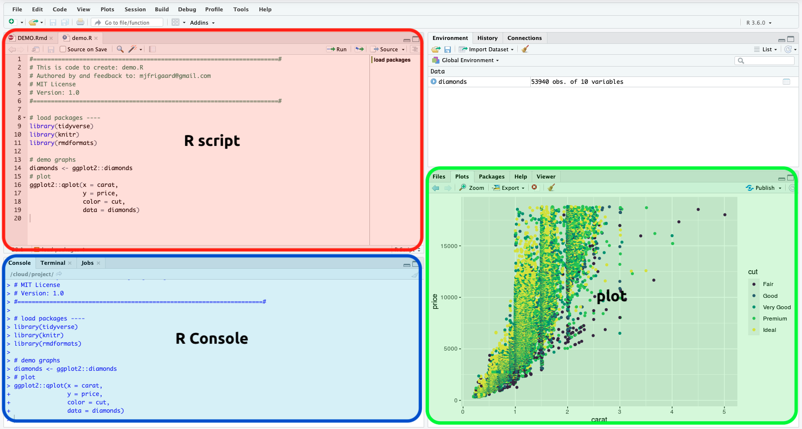
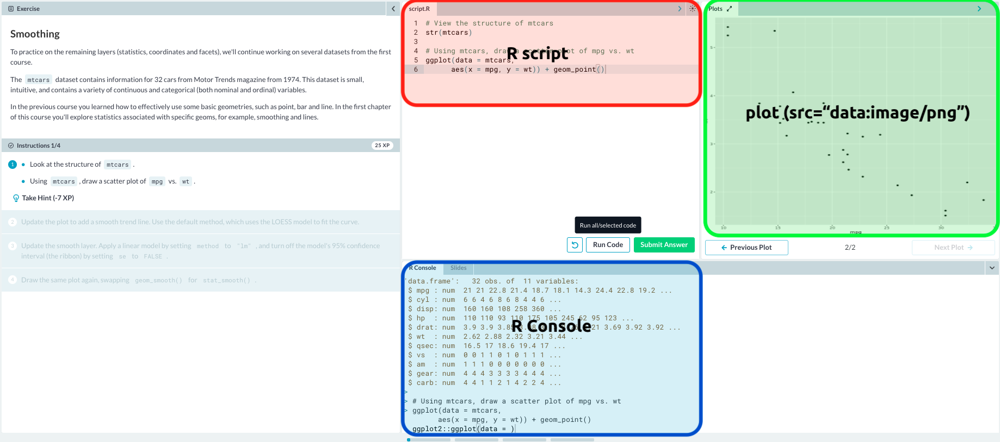

ggplot2 (setup & layout)
================
Martin Frigaard

  - [Preferred setup](#preferred-setup)
      - [`ggplot2` images in RStudio](#ggplot2-images-in-rstudio)
      - [`ggplot2` images in Datacamp](#ggplot2-images-in-datacamp)
      - [Taking notes?](#taking-notes)
      - [Resources](#resources)
          - [Possible options?](#possible-options)
      - [Optional layouts in Katacoda](#optional-layouts-in-katacoda)
          - [The `Terminal`](#the-terminal)
          - [The `2x Terminal Split`](#the-2x-terminal-split)
          - [The `Editor + Terminal`](#the-editor-terminal)
          - [The `Terminal + Editor`](#the-terminal-editor)
          - [The `Terminal + Iframe` (application inside the
            dashboard).](#the-terminal-iframe-application-inside-the-dashboard.)

# Preferred setup

The layout for this scenario should be able to render the `ggplot2`
image in a window adjacent to the console/terminal.

## `ggplot2` images in RStudio

In RStudio, this looks like this:

## `ggplot2` images in Datacamp

In Datacamp, it looks like this:

## Taking notes?

It would also be great if the learners were able to use something like
[HackMD](https://hackmd.io/) to keep a copy of the code they’re writing?

## Resources

  - The Supported Layouts: This is the
    [documentation](https://www.katacoda.community/layouts.html) for the
    supported layouts

  - UI Layouts Examples: These are the supported [UI
    layouts](https://katacoda.com/scenario-examples/courses/uilayouts).

### Possible options?

The two UI layouts that look the most promising are the [Scenario with
Terminal iFrame
UI](https://katacoda.com/scenario-examples/courses/uilayouts/uilayout-terminal-iframe)
and the [Visualise Environment
Tab](https://katacoda.com/scenario-examples/courses/uilayouts/visualise-docker)

## Optional layouts in Katacoda

The options for layouts katacoda are available
[here](https://katacoda.com/docs/scenarios/layouts) and include the
following:

### The `Terminal`

Use command `terminal`

### The `2x Terminal Split`

Use command `terminal-terminal`

### The `Editor + Terminal`

Use command `editor-terminal`

### The `Terminal + Editor`

for the embedded presentation `editor-terminal-split` Make sure to
include `data-katacoda-layout="editor-terminal-split"` in the `html` for
the embedded code.

### The `Terminal + Iframe` (application inside the dashboard).

Requires `backend.port` within `index.json`

Use command `terminal-iframe`
