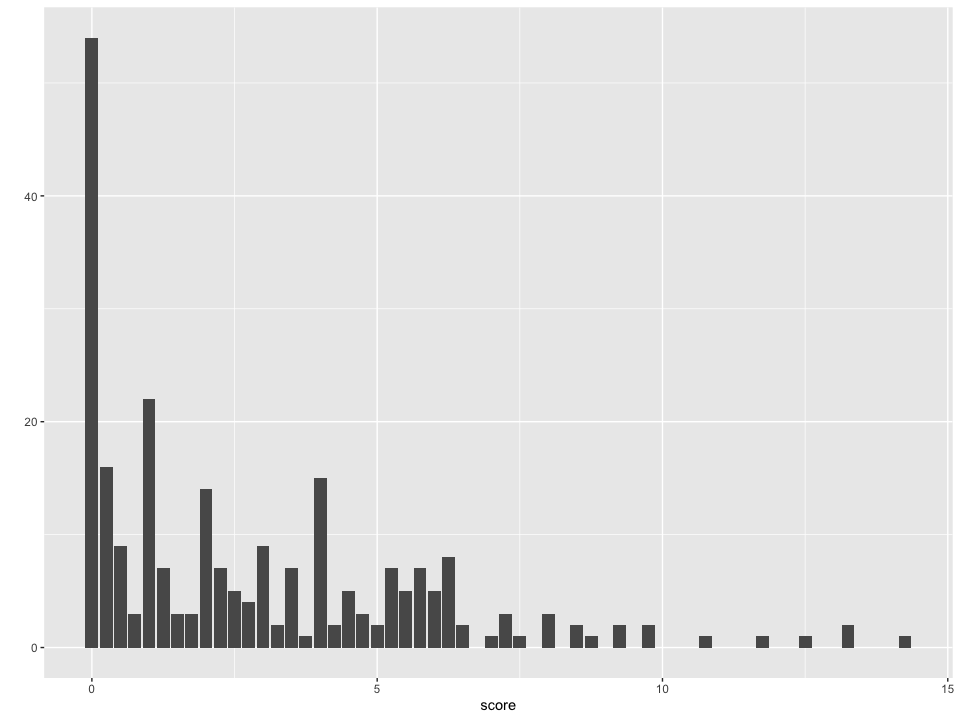
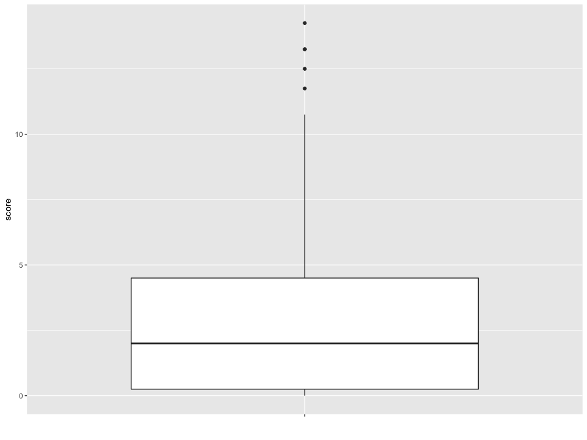
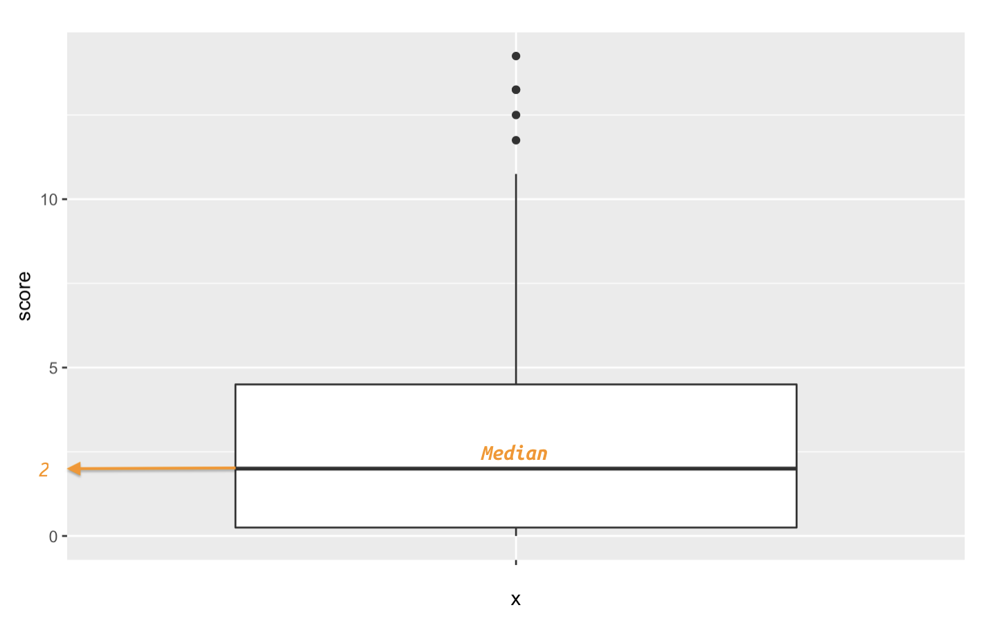

Build beautiful, customized graphs and charts in R with ggplot2
================
Martin Frigaard

  - [setup](#setup)
  - [intro](#intro)
      - [Exploring the data with
        ggplot2](#exploring-the-data-with-ggplot2)
  - [step 2](#step-2)
      - [`ggplot2`: a quick overview](#ggplot2-a-quick-overview)
          - [The lingua franca for graphical
            elements](#the-lingua-franca-for-graphical-elements)
          - [Building graphs, bit-by-bit](#building-graphs-bit-by-bit)
  - [step 3](#step-3)
      - [Terms and definitions: `geoms` and
        `aes`thetics](#terms-and-definitions-geoms-and-aesthetics)
      - [Starting with quick plots](#starting-with-quick-plots)
          - [Using the pipe (this -\> `%>%`)](#using-the-pipe-this--)
          - [Using geoms with
            ggplot2::qplot()](#using-geoms-with-ggplot2qplot)
          - [The bar plot](#the-bar-plot)
              - [What is this graph telling
                us?](#what-is-this-graph-telling-us)
          - [A box-plot](#a-box-plot)
              - [What is this graph telling
                us?](#what-is-this-graph-telling-us-1)
      - [Output the new tables as csv
        files](#output-the-new-tables-as-csv-files)

# setup

See `ggplot2-setup.Rmd` file.

# intro

## Exploring the data with ggplot2

In the previous scenario, we used the `tidyverse` and `fivethirtyeight`
packages to wrangle data in R.

<!-- insert link to previous scenario! -->

Now that we have some experience with data wrangling, we’ll extend what
we know into visualizing our data with the
[`ggplot2`](https://ggplot2.tidyverse.org/) package.

# step 2

## `ggplot2`: a quick overview

The `ggplot2` package is an implementation of the [“Grammar of
Graphics”](https://amzn.to/2MRRCAB) by Leland Wilkinson. This text
outlines a foundation for understanding the components of just about
every graph or figure we’ve encountered (and some we haven’t). `ggplot2`
extends these concepts into a powerful grammar for developing data
visualizations in R.

**Why have a ‘grammar’ of data visualization?**

[Wilhelm von
Humboldt](https://en.wikipedia.org/wiki/Wilhelm_von_Humboldt) has
described a language as a system for “*making infinite use of finite
means.*” Grammar is the set of rules we use to generate and display
comprehensible thought (to humans or computers). Within the R language,
`ggplot2` provides the grammar (or set of rules) we can learn to develop
a rich vocabulary for data visualizations. Knowing how to use
`ggplot2`’s grammar also gives us an excellent mental model for
thinking about individual graphical elements.

### The lingua franca for graphical elements

We’ll extend the definition of ‘grammar’ above to include Steven
Pinker’s description of language in [The Sense of
Style](https://www.amazon.com/Sense-Style-Thinking-Persons-Writing/dp/0143127799),
“*\[language is\] our species’ solution to the problem of getting
complicated thoughts from one head into another*.” In this sense, the
`ggplot2` package gives us an ability to communicate the *complexities*
of our data in the same way that scientific jargon allows us to
precisely and unambiguously define ideas.

### Building graphs, bit-by-bit

Lastly, `ggplot2` has an expansive vocabulary, so by learning a finite
list of `ggplot2` functions and their syntax will allow us to build a
seemingly unlimited number of visualizations.

# step 3

## Terms and definitions: `geoms` and `aes`thetics

A geom (or geometric object) is the ‘things’ we see on the graph or plot
(his includes dots or points, lines, bars, etc.)

`geom`s are combined with aesthetic mappings, which are properties we
*perceived* on the plot or graph (this includes things like color, size,
position, and shape)

## Starting with quick plots

We will start using `ggplot2` with the `qplot()` function. `qplot()` is
short for ‘quick plot’, and it takes the following arguments:

``` r
Data %>% 
  ggplot2::qplot(data = ., 
                 x = variable_x, 
                 y = variable_y,
                 geom = "shape")
```

### Using the pipe (this -\> `%>%`)

In the code above, you may have noticed the `data = .` argument. The
period (`.`) here is a product of the pipe syntax provided by the
[`magrittr` package](https://magrittr.tidyverse.org/).

A pipe `%>%` is what’s referred to as syntactic sugar (yes, that’s
[really a term](https://en.wikipedia.org/wiki/Syntactic_sugar)) because
it’s,

“*syntax within a programming language that is designed to make things
easier to read or to express*”

By placing the `data = .` on the right-hand side of the pipe operator
(`%>%`), we are telling R to read this statement as, “*the object to the
left of the `%>%` belongs in the `data` argument.*”

Writing R code this way makes it easier to combine function calls, and
it’s easier to read. For example, if we had to wrangle our data before
creating a graph (which we almost always do), we wouldn’t want to read
the functions inside out:

``` r
# instead of this...
function_02(function_01(x), y) 

# we see this
x %>% function_01() %>% function_02(y) 
```

See the figure below:


`geom =` argument to explore data from The Economist’s Medium post
titled, [“Mistakes, we’ve drawn a
few”](https://medium.economist.com/mistakes-weve-drawn-a-few-8cdd8a42d368).

These data are available for download here as part of the
[\#TidyTuesday]() project.

``` r
# Brexit ----
Brexit <- readr::read_csv("data/Brexit.csv")

# Corbyn ----
Corbyn <- readr::read_csv("data/Corbyn.csv")

# Dogs ----
Dogs <- readr::read_csv("data/Dogs.csv")

# EuBalance ----
EuBalance <- readr::read_csv("data/EuBalance.csv")

# Pensions -----
Pensions <- readr::read_csv("data/Pensions.csv")

# Trade -----
Trade <- readr::read_csv("data/Trade.csv")

# WomenResearch -----
WomenResearch <- readr::read_csv("data/WomenResearch.csv")
```

### Using geoms with ggplot2::qplot()

Using the geoms in `ggplot2::qplot()` means supplying the `geom =`
argument with a type of graph. The syntax looks like this:

The `geom = shape` will be replaced by a geom or type of graph (`"bar"`,
`"point"`, “box”)

In the [Mad Men
article](https://fivethirtyeight.com/features/mad-men-is-ending-whats-next-for-the-cast/),
the variables are described with the language below,

``` r
MadMen <- fivethirtyeight::mad_men
MadMen %>% dplyr::glimpse(78)
```

    #> Rows: 248
    #> Columns: 15
    #> $ performer     <chr> "Steven Hill", "Kelli Williams", "LisaGay Hamilton", …
    #> $ show          <chr> "Law & Order", "The Practice", "The Practice", "The P…
    #> $ show_start    <int> 1990, 1997, 1997, 1997, 1997, 1997, 1997, 1997, 1990,…
    #> $ show_end      <chr> "2010", "2014", "2014", "2014", "2014", "2014", "2014…
    #> $ status        <chr> "END", "END", "END", "END", "END", "END", "END", "END…
    #> $ charend       <int> 2000, 2003, 2003, 2003, 2004, 2004, 2004, 2004, 2004,…
    #> $ years_since   <int> 15, 12, 12, 12, 11, 11, 11, 11, 11, 11, 10, 10, 10, 1…
    #> $ num_lead      <int> 0, 0, 2, 0, 2, 0, 0, 0, 0, 0, 3, 0, 1, 1, 5, 2, 0, 1,…
    #> $ num_support   <int> 0, 1, 0, 0, 7, 4, 2, 1, 0, 1, 1, 7, 1, 2, 9, 4, 6, 5,…
    #> $ num_shows     <int> 0, 6, 2, 0, 6, 5, 3, 1, 0, 0, 10, 9, 8, 7, 7, 5, 4, 3…
    #> $ score         <dbl> 0.00, 6.25, 4.00, 0.00, 9.75, 6.00, 3.50, 1.25, 0.00,…
    #> $ score_div_y   <chr> "0", "0.520833333", "0.333333333", "0", "0.886363636"…
    #> $ lead_notes    <chr> NA, NA, "Life of a King, 2014; Go For Sisters, 2013",…
    #> $ support_notes <chr> NA, "Any Day Now (2012)", NA, NA, "The Messengers, 20…
    #> $ show_notes    <chr> NA, "Medical Investigation, Season 1; Lie To Me, Seas…

> I zeroed in on the actors who had been on a defunct show or, if the
> program was still on the air, had left the show. This encompassed 248
> performers, all of whom were given a score for their post-show career.
> They received:
> 
>   - 1 point for each season they regularly appeared on another TV
>     show.
>   - 1 point for each time they had a leading role in a film.
>   - 0.25 points for each supporting role in a film.

The variables outlined above are `num_shows`, `num_lead`, `num_support`,
and they give us the `score_div_y` (or *“Score” divided by “Years
Since”*). The `score_div_y` and `years_since` then give us the total
`score`. These data are presented in the article as a table, but I’ll
explore the `score` variable using two geoms from `ggplot2`.

### The bar plot

Using the geoms in `ggplot2::qplot()` means supplying the `geom =`
argument with a type of graph.

A bar-plot might help us understand the distribution of `score` in the
`MadMen` data. I can build this graph using the template above,
substituting the `MadMen` for `Data`, `score` in the `x` variable
position, and `"bar"` for `"shape"`.

``` r
MadMen %>% ggplot2::qplot(data = ., 
                        x = score, 
                        geom = "bar")
```

<!-- -->

#### What is this graph telling us?

The `geom = "bar"` displays the `score` values in the height of each bar
(i.e. their `count`, as indicated by the `y` axis). These bars aren’t
equal heights, and the highest bar is at `0`. Fewer tall bars are on the
right side of the graph (high `score`s), only four bars have a `count`
higher than `10` (all are under `5`).

The article indicated, “*The median actor in our set had a score of 2*”,
but it’s not clear where the median value is in the bar-plot. To view
how this statistic fits into the distribution of `score`, I will use the
`geom = "boxplot"`.

### A box-plot

Change the code above to use a `geom = "boxplot"`, but map `score` to
the `y` axis and give the `x` axis a blank character string (`" "`).

``` r
MadMen %>% ggplot2::qplot(data = ., 
                        x = " ", 
                        y = score,
                        geom = "boxplot") 
```

<!-- -->

#### What is this graph telling us?

Box-plots (or box and whisker plots) display five statistical concepts
in a single graph. These were initially introduced by John Tukey in his
1977 book, [“Exploratory Data Analysis.”](https://amzn.to/2t8lUWI)

<!-- The image below is a taken from page 41,  -->

<!-- ```{r IMAGE-og-box-whisker, echo=FALSE} -->

<!-- # fs::dir_ls("figs") -->

<!-- knitr::include_graphics(path = "figs/og-box-whisker.png") -->

<!-- ``` -->

Box-plots display the five number summary, which includes the smallest,
largest, median, and upper and lower quartiles (quartiles divide the
numbers into a percentage, and the 25th and 75th are included on the
graph). Box-plots also display ‘outliers’, or extreme values as dots or
points.

In order to get an idea of what I should be seeing on the graph, I will
use the `base::summary()` function to list the `Min`, `1st Qu.`,
`Median`, `Mean`, `3rd Qu.`, and `Max.` This is a five number summary
plus the mean (or average).

``` r
base::summary(MadMen$score)
```

    #>    Min. 1st Qu.  Median    Mean 3rd Qu.    Max. 
    #>   0.000   0.250   2.000   2.793   4.500  14.250

The `Median` is the horizontal line within the box, and if I look over
to the `y` axis, I can see this corresponds to a score of 2 (just like
the article stated).



Can you guess which bars in the bar-plot correspond to the points on the
box-plot?

## Output the new tables as csv files

Use `write_csv(as.data.frame(x = Data, file = "path/to/file.csv"))` and
voilá, you have a csv.

``` r
readr::write_csv(as.data.frame(MadMen), path = "data/MadMen.csv")
```

<!---
## A recap of what we learned

We used the pipe operator to string together various `tidyr` and `dplyr` functions for structuring our data (in tibbles). Remember that:

- `dplyr::arrange()` sorts the data in each column  

- `tidyr::separate()` divides the contents of a column apart into new *columns* 
- `tidyr::separate_rows()` split the contents of a column into new *rows* 
- `tidyr::unite()` sticks the contents from one column onto the contents of another column  

- `tidyr::gather()` collects and indexes data across columns and puts them into into rows 
- `tidyr::spread()` distributes indexed data from rows into columns  

- using `geom`s in `ggplot2::qplot()` 

- `base::summary()` to get the five number (and mean) 

In the next tutorial we will expand our `ggplot2` abilities. 

### End
--->
