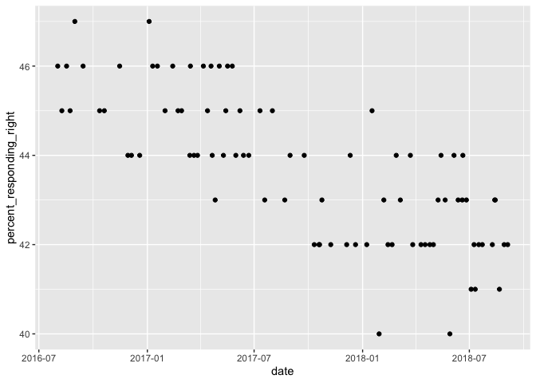
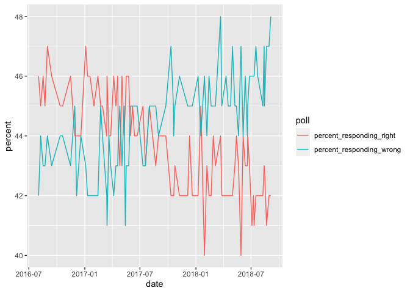
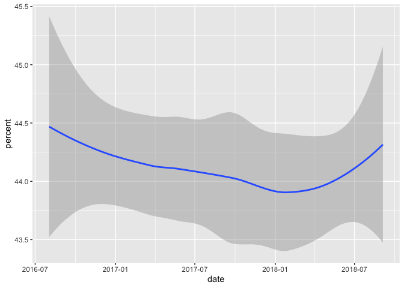
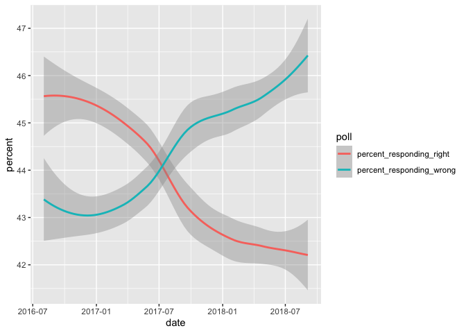
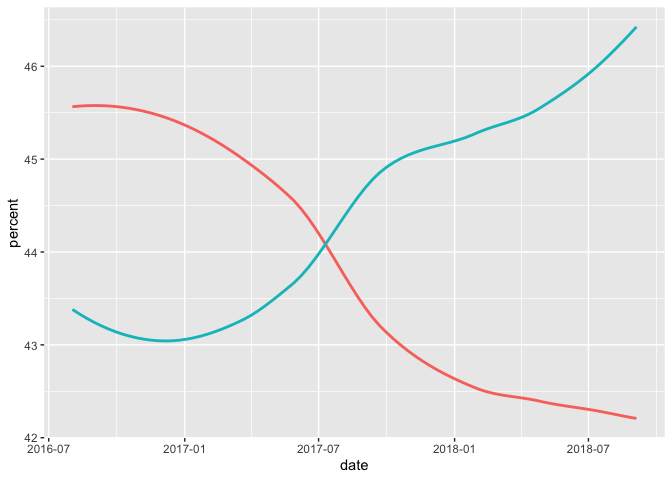
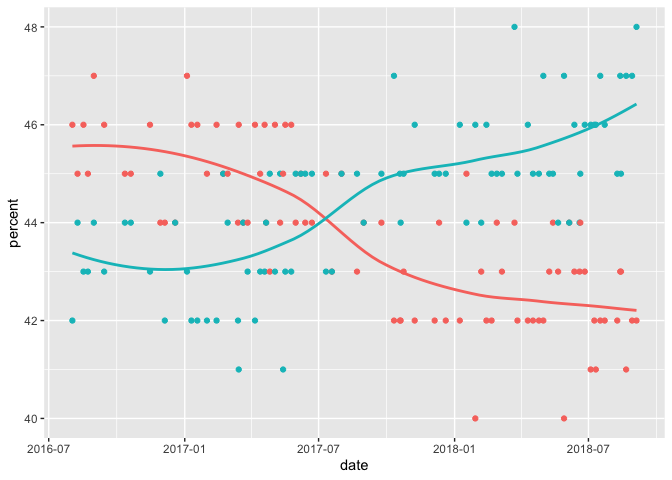
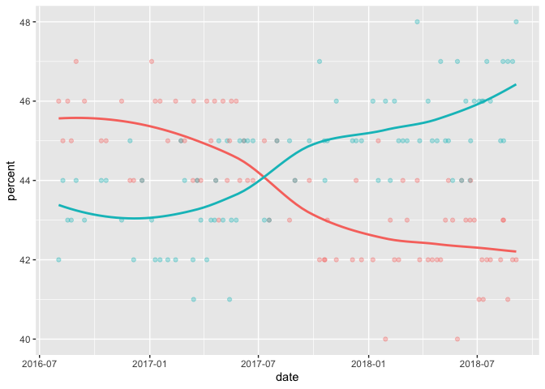
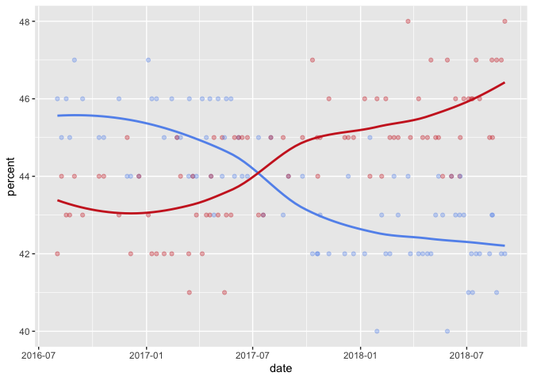

Build beautiful, customized graphs and charts in R with ggplot2
================
Martin Frigaard

  - [setup](#setup)
  - [Outline](#outline)
      - [intro](#intro)
          - [Exploring the data with
            ggplot2](#exploring-the-data-with-ggplot2)
      - [step 1](#step-1)
      - [`ggplot2`: a quick overview](#ggplot2-a-quick-overview)
          - [Why have a ‘grammar’ of data
            visualization?](#why-have-a-grammar-of-data-visualization)
          - [The lingua franca for graphical
            elements](#the-lingua-franca-for-graphical-elements)
          - [Building graphs, bit-by-bit](#building-graphs-bit-by-bit)
      - [step 2](#step-2)
          - [Install and load the
            tidyverse](#install-and-load-the-tidyverse)
          - [Terms and definitions: `geoms` and
            `aes`thetics](#terms-and-definitions-geoms-and-aesthetics)
      - [Starting with quick plots](#starting-with-quick-plots)
      - [step 3](#step-3)
      - [the pipe `%>%`](#the-pipe)
          - [How the pipe works](#how-the-pipe-works)
      - [step 4](#step-4)
      - [Using the pipe (cont.)](#using-the-pipe-cont.)
      - [step 5](#step-5)
      - [Lets get some data\!](#lets-get-some-data)
      - [step 6](#step-6)
      - [Visualizing a single variable](#visualizing-a-single-variable)
          - [Creating a single variable
            plot](#creating-a-single-variable-plot)
      - [step 7](#step-7)
      - [Visualizing a single variable
        (cont.)](#visualizing-a-single-variable-cont.)
      - [step 8](#step-8)
      - [Visualizing the relationship between two
        variables](#visualizing-the-relationship-between-two-variables)
          - [Changing character variables to
            dates](#changing-character-variables-to-dates)
      - [step 9](#step-9)
      - [Wrangling and visualizing](#wrangling-and-visualizing)
          - [Restructure and plot](#restructure-and-plot)
      - [step 10](#step-10)
      - [Building plots layer-by-layer with
        `ggplot()`](#building-plots-layer-by-layer-with-ggplot)
      - [step 11](#step-11)
      - [Adding aesthetics and layers](#adding-aesthetics-and-layers)
      - [step 11](#step-11-1)
      - [Settings inside `aes()` vs. inside
        `geom()`](#settings-inside-aes-vs.-inside-geom)
          - [Adding colors manually](#adding-colors-manually)
      - [step12](#step12)
      - [step13](#step13)
      - [step14](#step14)
      - [step15](#step15)
      - [finish](#finish)

# setup

To see how to set up the Katacoda environment and layout, check out the
`ggplot2-setup.Rmd` file.

# Outline

Below are the 15 steps (plus `intro` and `finish`) files in the
scenario.

## intro

  - [x] included in intro.md?

Welcome to ‘Building beautiful, customized graphs and charts in R with
ggplot2’\! In this scenario we’ll go over some basic graphing principles
using the popular `ggplot2` package.

`ggplot2` is part of the `tidyverse`, which is a collection of
opinionated packages from RStudio that [‘*you’re likely to use in
everyday data analyses.*’](https://www.tidyverse.org/packages/)

### Exploring the data with ggplot2

In the previous scenario, we used the `tidyverse` and `fivethirtyeight`
packages to wrangle data in R.

<!-- insert link to previous scenario! -->

Now that we have some experience with data wrangling, we’ll extend what
we know into visualizing our data with the
[`ggplot2`](https://ggplot2.tidyverse.org/) package.

## step 1

  - [x] included in step1.md?

## `ggplot2`: a quick overview

The `ggplot2` package is an implementation of the [“Grammar of
Graphics”](https://amzn.to/2MRRCAB) by Leland Wilkinson. This text
outlines a foundation for understanding the components of just about
every graph or figure we’ve encountered (and some we haven’t). `ggplot2`
extends these concepts into a powerful grammar for developing data
visualizations in R.

### Why have a ‘grammar’ of data visualization?

[Wilhelm von
Humboldt](https://en.wikipedia.org/wiki/Wilhelm_von_Humboldt) has
described a language as a system for “*making infinite use of finite
means.*” Grammar is the set of rules we use to generate and display
comprehensible thought (to humans or computers). Within the R language,
`ggplot2` provides the grammar (or set of rules) we can learn to develop
a rich vocabulary for data visualizations. Knowing how to use
`ggplot2`’s grammar also gives us an excellent mental model for
thinking about individual graphical elements.

### The lingua franca for graphical elements

We’ll extend the definition of ‘grammar’ above to include Steven
Pinker’s description of language in [The Sense of
Style](https://www.amazon.com/Sense-Style-Thinking-Persons-Writing/dp/0143127799),
“*\[language is\] our species’ solution to the problem of getting
complicated thoughts from one head into another*.” In this sense, the
`ggplot2` package gives us an ability to communicate the *complexities*
of our data in the same way that scientific jargon allows us to
precisely and unambiguously define ideas.

### Building graphs, bit-by-bit

Lastly, `ggplot2` has an expansive vocabulary, so by learning a finite
list of `ggplot2` functions and their syntax will allow us to build a
seemingly unlimited number of visualizations.

## step 2

  - [x] included in step2.md?

### Install and load the tidyverse

Launch an R console by clicking here -\> `R`{{execute}} (Click on the
*Run command* icon)

Load the `tidyverse` package by typing or copying and pasting the code
below.

``` r
install.packages("tidyverse")
library(tidyverse)
```

### Terms and definitions: `geoms` and `aes`thetics

A *geom* (or geometric object) is the ‘thing’ we see on a graph or plot
(this includes dots or points, lines, bars, etc.).

*geoms* are combined with aesthetic mappings, which are properties of
the ‘thing’ on the plot or graph (this includes things like color, size,
position, and shape).

So every graph or plot has a geom, and that geom will also have some
visual properties called aesthetics.

## Starting with quick plots

We will start using `ggplot2` with the `qplot()` function. `qplot()` is
short for ‘quick plot’, and it takes the following arguments:

``` r
ggplot2::qplot(data = Data, # assume dataset 'Data'
               x = variable_x, # single column on the x
               y = variable_y, # single column on the y
               geom = "shape") # the 'thing' on the graph
```

## step 3

  - [x] included in step3.md?

## the pipe `%>%`

A major reason for using the `tidyverse` is the pipe operator from the
[`magrittr` package](https://magrittr.tidyverse.org/).

The pipe (`%>%`) is what’s referred to as syntactic sugar (yes, that’s
[really a term](https://en.wikipedia.org/wiki/Syntactic_sugar)) because
it’s,

“*syntax within a programming language that is designed to make things
easier to read or to express*”

Assume the same dataset `Data`, and two variables `variable_x` and
`variable_y`. If we wanted to use the pipe with the `ggplot2::qplot()`
function, it would look like the code below:

``` r
Data %>% 
  ggplot2::qplot(data = ., 
                 x = variable_x, 
                 y = variable_y,
                 geom = "shape")
```

### How the pipe works

Writing R code this way makes it easier to combine function calls, and
it’s easier for to read. For example, if we had to wrangle our data
before creating a graph (which we almost always do), we wouldn’t want to
read the functions inside out:

``` r
# instead of this...
function_02(function_01(x), y) 

# we see this
x %>% function_01() %>% function_02(y) 
```

## step 4

  - [x] included in step4.md?

## Using the pipe (cont.)

[`magrittr` package](https://magrittr.tidyverse.org/) has some
additional tricks that are worth knowing. For example, in the code
above, you may have noticed the `data = .` argument.

    Data %>% 
      ggplot2::qplot(data = ., 
                     x = variable_x, 
                     y = variable_y,
                     geom = "shape")

The period (`.`) here is a product of the pipe syntax. We use the `.`
argument because of where the `data =` argument sits inside the
`qplot()` function. See the `args()` by using `args(qplot)`{{execute}}

    function(x, y, ..., data, 
            # all other optional arguments
            facets = NULL, 
            margins = FALSE, 
            geom = "auto", 
            xlim = c(NA, NA), 
            ylim = c(NA, NA), 
            log = "", 
            main = NULL, 
            xlab = NULL, 
            ylab = NULL, 
            asp = NA, 
            stat = NULL, 
            position = NULL) 

We can see the `data` argument comes *after* the `x`, `y`, and any other
variable arguments `...`. That means we need to tell the pipe we want
the `Data` to be in the named `data =` argument, so we use `data = .`

So by using the pipe, we can rewrite this function,

    function(y, named_argument = x)

to this:

    x %>% function(y, named_argument = .)

By placing the `data = .` on the right-hand side of the pipe operator
(`%>%`) in the `named_argument` position, we’re telling R to read this
statement as, “*the object to the left of the `%>%` belongs in the
`data` argument.*”

We can demonstrate this with the `diamonds` dataset in the `ggplot2`
package.

``` r
diamonds <- ggplot2::diamonds
diamonds %>% 
  ggplot2::qplot(data = ., 
                 x = carat, 
                 y = price,
                 geom = "point")
```

<!-- -->

See the figure below:


## step 5

  - [x] included in step5.md?

## Lets get some data\!

We will be using `ggplot2` to explore data from the Economist’s Medium
post titled, [“Mistakes, we’ve drawn a
few”](https://medium.economist.com/mistakes-weve-drawn-a-few-8cdd8a42d368).

These data are available for download as part of the
[\#TidyTuesday](https://github.com/rfordatascience/tidytuesday) project
on Github.

``` r
# Brexit 
Brexit <- readr::read_csv("https://bit.ly/brexit-data")
# Corbyn 
Corbyn <- readr::read_csv("https://bit.ly/corbyn-data")
# Pensions 
Pensions <- readr::read_csv("https://bit.ly/pensions-data")
```

We can examine each dataset using the `dplyr::glimpse()`,
`utils::head()`, or `utils::str()` arguments we learned about in the
last scenario.

``` r
Brexit %>% dplyr::glimpse()
```

    #> Rows: 85
    #> Columns: 3
    #> $ date                     <chr> "2/8/16", "9/8/16", "17/08/16", "23/08/16"…
    #> $ percent_responding_right <dbl> 46, 45, 46, 45, 47, 46, 45, 45, 46, 44, 44…
    #> $ percent_responding_wrong <dbl> 42, 44, 43, 43, 44, 43, 44, 44, 43, 45, 42…

``` r
Corbyn %>% utils::head()
```

    #> # A tibble: 6 x 2
    #>   political_group avg_facebook_likes
    #>   <chr>                        <dbl>
    #> 1 Jeremy Corbyn                 5210
    #> 2 Labour Party                   845
    #> 3 Momentum                       229
    #> 4 Owen Smith                     127
    #> 5 Andy Burnham                   105
    #> 6 Saving Labour                   56

``` r
Pensions %>% utils::str()
```

    #> tibble [35 × 3] (S3: spec_tbl_df/tbl_df/tbl/data.frame)
    #>  $ country              : chr [1:35] "Australia" "Austria" "Belgium" "Brazil" ...
    #>  $ pop_65_percent       : num [1:35] 15.04 18.76 18.22 7.84 16.14 ...
    #>  $ gov_spend_percent_gdp: num [1:35] 5.2 13.86 10.36 12 4.31 ...
    #>  - attr(*, "spec")=
    #>   .. cols(
    #>   ..   country = col_character(),
    #>   ..   pop_65_percent = col_double(),
    #>   ..   gov_spend_percent_gdp = col_double()
    #>   .. )

More information on the datasets are below:

  - `Corbyn` is a dataset of average Facebook likes and political
    leader/group.

  - `Brexit` is a dataset of Brexit poll opinions (with dates).

  - `Dogs` is a dataset of dog body weights (in kgs) and average neck
    size (in cm), along with the date the dog was registered with the
    UK’s kennel club.

  - `EuBalance` is a dataset of countries, the country budget
    balance/current-account balance, the year, and the value in billions
    or euros.

  - `Pensions` is a dataset of countries, percent of the country’s
    population 65 years old or over, and the percent of government
    spending on pensions as percent of GDP.

  - `Trade` is a dataset of the United States trade deficit with China
    in goods (in US dollar), the manufacturing employment in the US, and
    the year.

  - `WomenResearch` is a dataset of countries, field of scientific
    study, and women among researchers with papers published between
    2011-15 as percent of the total by field of study.

## step 6

  - [x] included in step6.md?

## Visualizing a single variable

Before we look at how variables relate to one another, we should get an
idea for how each variable looks independently, or it’s
[distribution.](https://en.wikipedia.org/wiki/List_of_probability_distributions).

How we visualize a variable’s distribution depends on whether it’s
**numeric** or **categorical**.

**Numeric** variables can be *continuous*–which means they can be any
value including `0`–and are typically thought of as raw measurements
(i.e. human body weight, speed, time in seconds, etc.).

*Categorical* numeric variables count discrete items or events, such as
Facebook ‘like’s or number of page views. Categorical numeric variables
are different from continuous variables because the have a fixed set of
possible values (i.e. you can’t have 1/2 a Facebook ’like’).

A special case of categorical variable is a *binary* variable, which
only has two possible values (`0` or `1`, `alive` or `dead`, `yes` or
`no`, etc.)

### Creating a single variable plot

We will view the distribution of the `avg_facebook_likes` from the
`Corbyn` dataset using `ggplot2::qplot()`.

``` r
# the data 
Corbyn %>% 
  # the variable 
  ggplot2::qplot(x = avg_facebook_likes, 
                 # the dot
                 data = .) 
```

<!-- -->

*What is this graph telling us?*

Well, we can print the entire Corbyn dataset to the console to view it
(it’s not very big).


We can see the tibble printed to the screen has the `avg_facebook_likes`
sorted descending, with the highest number on top (`5210`) and the
lowest number on the bottom (`56`).

When we give the `qplot()` function a single variable, it assumes we
want a
[histogram](https://ggplot2.tidyverse.org/reference/geom_histogram.html).

The histogram is displaying the `avg_facebook_likes` variable by
splitting up the x axis into `bins`, then plotting the count for each
number of observations in each bin on the `y` axis.


## step 7

  - [x] included in step7.md

## Visualizing a single variable (cont.)

Histograms are a great way to visualize the distribution of a single
variable, but there are other `geom`s too. For example, the box-plot
gives us a graph and quite a few summary statistics for any given
numerical variable.

Below is a box-plot of the `pop_65_percent` from the `Pensions` dataset.

``` r
# the data 
Pensions %>% 
  # the variable 
  ggplot2::qplot(x = pop_65_percent, 
                 # the dot
                 data = .,
                 geom = "boxplot") 
```

<!-- -->

The box-plot gives us an idea of `pop_65_percent`’s distribution by
using the white box to show where the median (middle value), 1st and 3rd
quartiles, higher/lower values, and outliers (see image below)


For more on the statistics displayed in the box-plot, read up on the
[`geom_boxplot()`
documentation](https://ggplot2.tidyverse.org/reference/geom_boxplot.html).

Other options for individual variables include the [`geom =
"density"`](https://ggplot2.tidyverse.org/reference/geom_density.html)
and [`geom =
"violin"`](https://ggplot2.tidyverse.org/reference/geom_violin.html).

## step 8

  - [x] included in step8.md

## Visualizing the relationship between two variables

What if we want to graph the relationship between two variables? In this
step, we’ll graph two variables from the `Brexit` dataset. Use the
terminal to view this dataset with `dplyr::glimpse()` or `utils::str()`:

``` r
dplyr::glimpse(Brexit)
```

    #> Rows: 85
    #> Columns: 3
    #> $ date                     <chr> "2/8/16", "9/8/16", "17/08/16", "23/08/16"…
    #> $ percent_responding_right <dbl> 46, 45, 46, 45, 47, 46, 45, 45, 46, 44, 44…
    #> $ percent_responding_wrong <dbl> 42, 44, 43, 43, 44, 43, 44, 44, 43, 45, 42…

``` r
utils::str(object = Brexit)
```

    #> tibble [85 × 3] (S3: spec_tbl_df/tbl_df/tbl/data.frame)
    #>  $ date                    : chr [1:85] "2/8/16" "9/8/16" "17/08/16" "23/08/16" ...
    #>  $ percent_responding_right: num [1:85] 46 45 46 45 47 46 45 45 46 44 ...
    #>  $ percent_responding_wrong: num [1:85] 42 44 43 43 44 43 44 44 43 45 ...
    #>  - attr(*, "spec")=
    #>   .. cols(
    #>   ..   date = col_character(),
    #>   ..   percent_responding_right = col_double(),
    #>   ..   percent_responding_wrong = col_double()
    #>   .. )

When we view the contents of `Brexit`, we can see the `date` column is a
character variable (`<chr>`), and the other two
variables–`percent_responding_right` and
`percent_responding_wrong`–are numeric (`<dbl>`).

### Changing character variables to dates

If we want to plot the relationship between `date` and the
`percent_responding_right`, we’ll first need to change the format of
`date` from character to `Date`, which we can do using the [`lubridate`
package](https://lubridate.tidyverse.org/) (also from the `tidyverse`).

Copy the code below and complete the `lubridate::mdy()` function to
format the `date` variable as a `Date`.

``` r
# first reformat the date variable as a date
# Brexit <- Brexit %>% mutate(date = lubridate::mdy(____))
Brexit <- Brexit %>% mutate(date = lubridate::mdy(date))
```

Use the `base::is.double()`, `base::class()`, or `base::typeof()`
function to figure out if you’ve formatted the new `date` variable
correctly.

``` r
base::is.double(Brexit$date)
```

    #> [1] TRUE

``` r
base::class(Brexit$date)
```

    #> [1] "Date"

``` r
base::typeof(Brexit$date)
```

    #> [1] "double"

After we’re sure the `date` variable has been formatted correctly, we
want to ‘pipe’ the formatted data to the `ggplot2::qplot()` function
with the new `date` variable on the `x` and the
`percent_responding_right` variable on the `y`.

``` r
Brexit %>% qplot(x = date, y = percent_responding_right, data = .)
```

<!-- -->

The `ggplot2::qplot()` function is smart enough to automatically choose
a `geom` depending on what type of variable we assign to the `x` and `y`
axes. In this case, the `percent_responding_right` variable is a `<dbl>`
(numeric), and we’ve reformatted the `date` variable into a double
before we passed it to the `y` axis.

The `ggplot2::qplot()` function knows to plot the dates on the `y` axes
(notice it displays only the `year`) and represent the data with `geom =
"points"`.

## step 9

  - [x] included in the step9.md?

## Wrangling and visualizing

Sometimes we might want to pass the data directly from a wrangling step
to a data visualization without assigning changes to the data frame. We
will demonstrate how this works using the same `Brexit` dataset.

If you read the [Medium
article](https://medium.economist.com/mistakes-weve-drawn-a-few-8cdd8a42d368),
you’ll find The Economist first plotted these data as a line graph, with
two lines (see ‘Original’ image below). The ‘Better’ way to improve the
graph would be to include points and smooth the line in the graph (see
below):


In order to re-create these graphs, we’ll need to restructure the
`Brexit` data with the `tidyr::pivot_longer()` function we learned about
in the last [scenario]().

Complete the code below by filling in the `cols =` argument as `date`,
the `names_to =` as `"poll"`, and the `values_to =` as `"percent"`.

    Brexit %>% pivot_longer(cols = , names_to =, values_to =)

We should end up with a dataset that has three variables: `date`,
`poll`, and `percent`. The data below display the top six rows you
should see when you’ve used `tidyr::pivot()` correctly.

    # A tibble: 170 x 3
       date       poll                     percent
       <date>     <chr>                      <dbl>
     1 2016-02-08 percent_responding_right      46
     2 2016-02-08 percent_responding_wrong      42
     3 2016-09-08 percent_responding_right      45
     4 2016-09-08 percent_responding_wrong      44
     5 NA         percent_responding_right      46
     6 NA         percent_responding_wrong      43

### Restructure and plot

After we’re sure the data are structured correctly, we won’t assign it
to the `Brexit` data frame. Instead, we’ll pass it straight through to
the `ggplot2::qplot()` function. The `date` variable will go on the `x`,
and the `percent` variable will go on the `y`. Click on the Run icon
below to see the graph.

First, we will create the ‘Original’ graph by using `geom = "line'`, but
we want a separate line for each `poll`. We can create this by adding
the `color = poll` aesthetic.

``` r
Brexit %>% 
  pivot_longer(cols = -date, 
               names_to = "poll", 
               values_to = "percent") %>% 
  ggplot2::qplot(x = date, 
                 y = percent, 
                 data = .,
                 geom = "line",
                 color = poll)
```

<!-- -->

As we can see from the graph above, being able to use the `color`
aesthetic extends the `qplot()`s capabilities by making it clear there
are two categories for `polls` represented in the graph.

In the next step, we’ll re-create the `Brexit` dataset.

## step 10

  - [x] included in step10.md

## Building plots layer-by-layer with `ggplot()`

Now that we’ve learned how to plot using geoms and aesthetics, we can
begin adding layers to the graph. In the previous step, we re-created
the ‘Original’ plot using `geom = "line"`.

As we start to build more complex, customized plots, we will want to
move away from using the `ggplot2::qplot()` function and start using
`ggplot2::ggplot()` function.

The `ggplot2::ggplot()` function initializes a graph, then we can ‘map’
variables to the axes, aesthetics, or groupings. We’ll start by
assigning the restructuring changes to the `Brexit` dataset.

``` r
Brexit <- Brexit %>% pivot_longer(-date, 
                                  names_to = "poll", 
                                  values_to = "percent")
```

The `ggplot()` follows a pretty standard template, and it’s similar to
the `qplot()` function. See below:

    <DATA> %>% 
      ggplot(mapping = aes(x = <MAPPINGS>, y = <MAPPINGS>))

We begin with a dataset, pass it over to to the `ggplot()` function,
then map the `x` and `y` variables. Run the code below to assign the
variable mappings to object `p`.

``` r
p <- Brexit %>% ggplot(mapping = aes(x = date, y = percent))
p
```

<!-- -->

There aren’t any points on the graph stored in object `p` because we
haven’t added any geoms or aesthetics. We’ll add the smoothed line in
the step below with `ggplot2::geom_smooth()` like the template below.

    <DATA> %>% 
      ggplot(mapping = aes(x = <MAPPINGS>, y = <MAPPINGS>)) + 
        <GEOM_FUNCTION>(mapping = aes(<MAPPINGS>))

**Note**: the `+` operator is used with `ggplot2` functions, not the
pipe `%>%` operator.

``` r
p + ggplot2::geom_smooth()
```

<!-- -->

*Why are we only seeing a single line?* We need to look at our template
again:

    <DATA> %>% 
      ggplot(mapping = aes(x = <MAPPINGS>, y = <MAPPINGS>)) + 
        <GEOM_FUNCTION>(mapping = aes(<MAPPINGS>))

This shows the aesthetic mapping (`aes(<MAPPINGS>)`) needs to be set
inside the geom we want to display. In this case, we want the lines
colored by the two kinds of polls. We can set this with `color = poll`.

``` r
p + ggplot2::geom_smooth(aes(color = poll))
```

<!-- -->

The default `ggplot2::geom_smooth()` function includes the gray
confidence interval around the smoothed line. We can remove this with
`se = FALSE`. We’ll also add the `show.legend = FALSE` argument to
remove the `poll` categories from the left-hand side of the graph.

Copy the code below and complete the `show.legend` argument and assign
the graph to the `p2` object.

``` r
p2 <- p + geom_smooth(aes(color = poll), se = FALSE, show.legend = FALSE)
p2
```

<!-- -->

In the next step, we’ll add the points to the graph. We’ve also updated
the template below for adding aesthetics.

    <DATA> %>% 
      ggplot(mapping = aes(x = <MAPPINGS>, y = <MAPPINGS>)) + 
        <GEOM_FUNCTION>(mapping = aes(<MAPPINGS>), 
                        optional_arguments = "values")

## step 11

## Adding aesthetics and layers

In the last step we added a `geom_smooth()` to the `p` object and
removed the standard errors (`se = FALSE`) and legend (`show.legend =
FALSE`). We stored these changes in the `p2` object.

    <DATA> %>% 
      ggplot(mapping = aes(x = <MAPPINGS>, y = <MAPPINGS>)) + 
        <GEOM_FUNCTION>(mapping = aes(<MAPPINGS>), 
                        optional_arguments = "values")

We’re going to continue building our plot by adding the
`ggplot2::geom_point()` function. We need to specify the `aes()`
argument (`color = poll`), and we’ll also include the `show.legend =
FALSE` argument again to remove the legend for the two `poll`
categories.

``` r
p2 + geom_point(aes(color = poll), show.legend = FALSE)
```

<!-- -->

This is starting to look more like the graph in the medium article, but
we still need to make a few minor adjustments.


`ggplot2` allows us to build graphs layer-by-layer using the geoms and
aesthetics to customize each plot so that they are necessarily
expressive. Each time we need to add something to a graph, we can either
add a new `geom`, or look for ways to adjust a geoms with new aesthetic
options.

For example, we can see from the ‘Original’ graph in the medium article
that the points are slightly transparent. This is the alpha transparency
argument, and it’s available inside nearly every `geom`.

We can add the `alpha` argument inside the `ggplot2::geom_point()`
function, and specify either a decimal, fraction, or numeric value.

``` r
p3 <- p2 + geom_point(aes(color = poll), alpha = 1/3, show.legend = FALSE)
p3
```

<!-- -->

Now the points are slightly transparent, which helps with over-plotting.

    <DATA> %>% 
      ggplot(mapping = aes(x = <MAPPINGS>, y = <MAPPINGS>)) + 
        <GEOM_FUNCTION>(mapping = aes(<MAPPINGS>), args = "options")

As you can see, the grammar of graphics makes it easy to think about
what we’d like to see on a plot, decide what kind of graph element it is
(`geom`, `aesthetic`, etc.), and then add it as a layer with the `+`
operator. Hopefully you can see how easy it is to customize a graph by
adding new layers and aesthetics\!

## step 11

  - [x] included in step11.md?

## Settings inside `aes()` vs. inside `geom()`

So far we have added the `aes()` argument *inside* each new `geom` layer
we’ve built, but there was a way to plan ahead and do this in the
original `ggplot()` function. See the code below:

``` r
Brexit %>% 
  ggplot(mapping = aes(x = date, y = percent, color = poll)) + 
              geom_smooth(se = FALSE, show.legend = FALSE) + 
                geom_point(alpha = 1/3, show.legend = FALSE)
```

<!-- -->

By adding `color = poll` in the `ggplot` function, it carries all the
way down through each `geom`. All we have to do is add the arguments for
each `geom`.

### Adding colors manually

We’d like to change the colors in the graph from the default colors to a
more traditional red and blue. We can do this by adding the
`ggplot2::scale_color_manual()` function and specifying the
values(`c("cornflowerblue", "firebrick3")`).

``` r
p3 +  
  scale_color_manual(values = c("cornflowerblue", "firebrick3"))
```

<!-- -->

For a full list of colors, check the pdf
[here](http://www.stat.columbia.edu/~tzheng/files/Rcolor.pdf).

## step12

## step13

## step14

## step15

## finish
