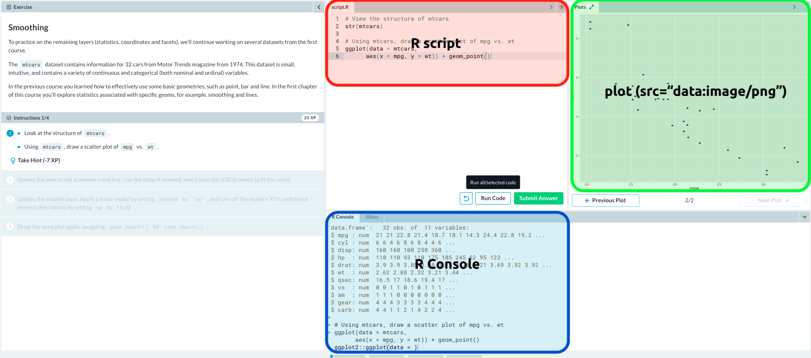

# Preferred setup

The layout for this scenario should be able to render the `ggplot2` image in a window adjacent to the console/terminal. 

## `ggplot2` images in RStudio

In RStudio, this looks like this: 

## `ggplot2` images in Datacamp

In Datacamp, it looks like this: 

## Taking notes?

It would also be great if the learners were able to use something like [HackMD](https://hackmd.io/) to keep a copy of the code they're writing?

## Resources

- The Supported Layouts: This is the [documentation](https://www.katacoda.community/layouts.html) for the supported layouts

- UI Layouts Examples: These are the supported [UI layouts](https://katacoda.com/scenario-examples/courses/uilayouts). 

The two UI layouts that look the most promising are the [Scenario with Terminal iFrame UI](https://katacoda.com/scenario-examples/courses/uilayouts/uilayout-terminal-iframe) and the [Visualise Environment Tab](https://katacoda.com/scenario-examples/courses/uilayouts/visualise-docker)
